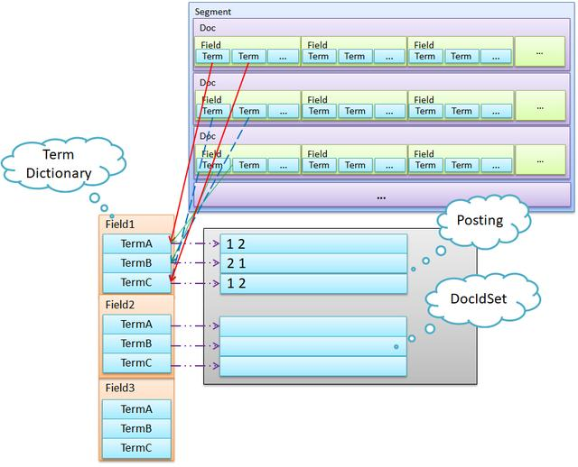

# [Lucene](https://github.com/apache/lucene-solr)
```md
Apache Lucene 是一个用 Java编写的高性能，全功能的文本搜索引擎库
```
## [WhatIs](WhatIs.md)

## Design
### 结构

```md
Lucene 的存储结构：
从大到小是Index -> Segment -> Doc -> Field -> Term，
类比 MySQL 为 Database -> Table -> Record -> Field -> Value。
```

### 流程

* [Index](design/index.md)
* [Search](design/search.md)

* LSM思想
```md
LSM (Log Structured Merge Tree)，
最早是谷歌的 “BigTable” 提出来的，目标是保证写入性能，同时又能支持较高效率的检索，
在很多 NoSQL 中都有使用，Lucene 也是使用 LSM 思想来写入。
```
```md
普通的B+树增加记录可能需要执行 seek+update 操作，这需要大量磁盘寻道移动磁头。
而 LSM 采用记录在文件末尾，顺序写入减少移动磁头/寻道，执行效率高于 B+树。
```
* FST
```md
数据字典 Term Dictionary，通常要从数据字典找到指定的词的方法是，将所有词排序，用二分查找即可。
这种方式的时间复杂度是 Log(N)，占用空间大小是 O(N*len(term))。
缺点是消耗内存，存在完整的term，当 term 数达到上千万时，占用内存非常大。
```
```md
lucene 从4开始大量使用的数据结构是FST（Finite State Transducer）。
FST有两个优点：
1. 空间占用小，通过读 term 拆分复用及前缀和后缀的重用，压缩了存储空间；
2. 查询速度快，查询仅有 O(len(term)) 时间复杂度
```
* SkipList
```md
为了能够快速查找 docid，lucene 采用了 SkipList这一数据结构。
SkipList有以下几个特征：
1. 元素排序的，对应到我们的倒排链，lucene 是按照 docid 进行排序，从小到大;
2. 跳跃有一个固定的间隔，这个是需要建立SkipList的时候指定好，例如下图以间隔是;
3. SkipList的层次，这个是指整个SkipList有几层
```
* BKD Tree
```md
根据FST思路，如果查询条件非常多，需要对每个条件根据 FST 查出结果，进行求并集操作。
如果是数值类型，那么潜在的 Term 可能非常多，查询销量也会很低，为了支持高效的数值类或者多维度查询，引入 BKD Tree。
```
```md
在一维下就是一棵二叉搜索树，在二维下是如果要查询一个区间，logN的复杂度就可以访问到叶子节点对应的倒排链。
```
* BitSet 过滤
```md
二进制处理，通过 BKD-Tree 查找到的 docID 是无序的，所以要么先转成有序的docID数组，或者构造 BitSet，然后再与其他结果合并。
```

## [SourceCode](sc/README.md)

## Resources
* [Lucene 技术细节](https://github.com/zzboy/lucene)