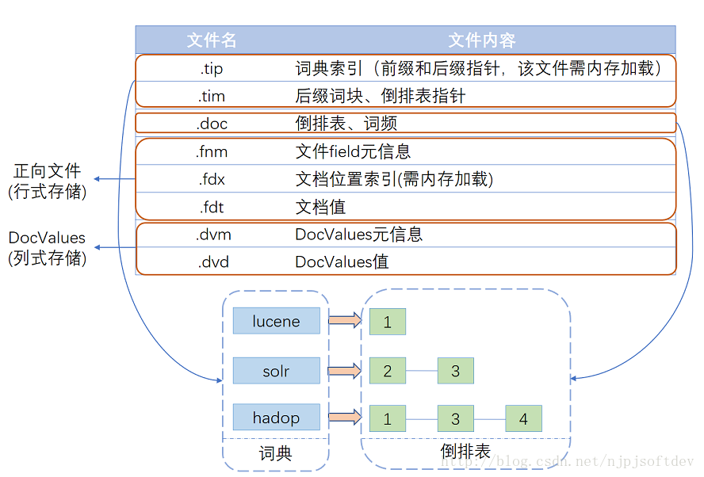

# Index

## 索引结构

* [词典 Dictionary](dictionary.md)
* 倒排表  Inverted List 
* 正向文件 
* 列式存储 DocValues

## 索引过程
```md
1) 有一系列被索引文件
2) 被索引文件经过语法分析和语言处理形成一系列词(Term) 。
3) 经过索引创建形成词典和反向索引表。
4) 通过索引存储将索引写入硬盘。
```

## 索引库创建方式
* 文件索引库
```java
final Path docDir = Paths.get("index");
Directory directory=FSDirectory.open(Paths.get("index"));
```
```md
是在本地磁盘上创建一个index文件夹，并且将索引放在index中，也称为文件索引库
优点：将索引持久化到磁盘上，能长久保存。
缺点：相比较内存索引库，读取慢
```
* 内存索引
```java
Directory directory= new RAMDirectory();
```
```md
只需要一行代码，就创建了一个内存索引库
优点：读取快
缺点：不具备持久化能力，结束时候内存索引库便会删除
```
* 两种索引库的结合
```md
根据两种索引库的特点我们可以将两种索引库结合起来，设计的思路是在程序启动时，将文件索引库中的索引拷贝到内存索引库中，
然后让程序与内存索引库交互，当交互完毕后再将内存索引库的索引持久化到文件索引库。
```
