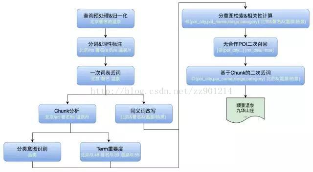

# [MT - 旅游搜索](https://blog.csdn.net/zz901214/article/details/78731046)
## 挑战
```md
1. 本异地差异大
    在本地生活场景中用户的搜索需求往往集中在本城市内，而在旅游场景特别是行前场景用户会先搜索异地的POI（门店）
2. 搜索意图多样
3. 底层脏数据多
```

## 评价指标
* 访购率 (支付用户数/搜索访问UV) - 是评估搜索效果的主指标
```md
美团点评是一家电商公司，营业收入是核心指标，以搜索为例，用户行为链条包括搜索 Query -> 点击搜索结果列表页中的POI/Deal等 -> 下单支付 ->消费。
如果只看点击率，关注的链条太短，没有反映交易属性；如果看最终的收入结果，
部分因素（消费受产品的购买限制、退款条件等影响，收入又跟商户拓展人员谈单的毛利等相关）非搜索可控。
```
* 点击率 (点击PV/搜索PV（Page View）)
```md
部分景点由于商户拓展人员没有谈单或者是免费景点等原因导致没有门票或线路游Deal可售时，访购率为零，
但用户可能需要了解景点相关信息，这时点击率是重要的辅助评价指标。
```
* 无结果率 (无结果请求数/搜索请求数)
```md
衡量搜索召回质量的重要指标
```
* 用户满意度
```md
由产品经理定期人工评测，比如取搜索结果的前20条，如果是单景点意图，对应的POI能排在首位，排序合理，无重复POI则为1分；
搜索结果满足部分用户需求，存在误召回、排序不合理的情况则为0.5分；
完全不能满足用户旅游需求，搜索结果没有有效信息则为0分。
```
## 策略迭代方法
```md
搜索的bad case往往非常明确，因此我们确立了以case驱动为主的策略迭代方法。
```
```md
1. 质量评估：定义满意度标准和评估体系，定期（月/季度）评估搜索满意度，确定评估样本，了解Query需求分布、意图识别准召率、召回及排序情况。
2. 问题分析：对问题进行梳理分类，比如无供给问题、误召回问题、意图识别问题、POI排序问题、展示问题等，找出主要问题并明确优化方向。
3. 项目开发：评估项目实施的可行性，制定相应的技术方案，配合产品、客户端等其他技术团队联调、测试。
4. 实验迭代：上线A/B Testing 验证优化效果，根据指标评估项目收益，效果正向则扩量，负向则分析调整或下线，并继续迭代优化。
```

## 召回策略迭代
* 全国召回
```md
无供给问题外最重要的一个原因是不支持异地搜索。
```
* 模块化展示
```md
对用户Query进行意图分类，每类意图定制召回策略和展现样式。
以意图占比为56%的景点POI为例，当用户搜索“长城”时会展现“长城相关景点”和“长城相关度假产品”两个类聚，
景点类聚只在POI字段域搜索“长城”，比如POI所在城市、名称，这些字段中不包含“故宫”Term，因此不会返回“故宫”POI。
度假产品类聚只限定在非门票 Deal集合内检索 Deal标题、品类、商圈等字段，返回的都是跟团游、酒景套餐自由行等线路游信息，方便用户决策。
```
```md
当用户在北京搜“上海”时是行政区意图，会展示“上海目的地”、“上海热门景点”、“北京-上海度假产品”、“上海当地度假产品”4个类聚，
其中“目的地”是为城市专门定制的落地页，“北京-上海度假产品”是根据出发地为北京、目的地为上海这两个线路游字段来进行检索。
```
```md
当用户搜索“温泉”时是品类意图，检索策略跟POI景点搜索类似，但会增加品类检索字段。
```
```md
同时为了降低无结果率，在一次召回无结果的基础上增加了二次、三次召回，比如增加POI商圈字段。
如果二次召回也没有结果，会增加门票Deal字段进行三次召回，返回门票结果。
```
```md
综上可知用户Query主要包含景点、行政区、品类、线路游4类意图，每类意图又可能展现多个类聚，每个类聚的召回检索策略不同。
而早期的技术架构在单次请求下只支持单策略检索，同时在多次召回时只能串行执行，因此需要对检索架构进行升级：
1. 由单任务执行变成多任务并行执行，比如搜索“故宫”时需要并发执行POI和线路游两个检索策略。
2. 由串行执行变成基于状态机的调度执行，比如POI策略下一次召回无结果，会增加商圈字段二次召回，再无结果时会基于门票Deal字段进行三次召回。
```
* 无结果优化
```md
其中32%原因是POI不在线（无供给，POI没有可售Deal），27%是POI品类错误（即POI品类标签不是旅游）。
```
* * 丢词&查询改写
```md
1. 丢词策略：
    通过挖掘Query日志，统计其中的高频停用词，比如的、一张、价格、团购、去哪等，对用户输入Query直接丢弃其中的停用词，再进行检索召回。
2. Query纠错&同义词改写
3. 二次召回
4. 无结果推荐
    推荐本身并不能降低无结果率，但在无结果时给用户提供了另外的选择。
```
* * 无合作POI召回
```md
1. 无法追回项目
    比如免费景区或全网无售（商户拓展人员无法谈单），这类case早期由于评价指标是访购率，搜索并不能召回，但其实对用户体验伤害较大，容易导致用户流失。
    因此放开一次召回无结果时二次召回无合作POI，比如搜索“潭柘寺”会返回结果，虽然暂无可售的Deal，但用户可以浏览POI详情页的景区简介、预订须知等。
2. 待追回项目
    即目前无供给，但可以反馈给商户拓展人员谈单，针对这类case建立了搜索反馈商户拓展人员上单的流程，
    自动生成任务工单并分派商户拓展人员处理，形成无结果反馈的整体闭环。
3. 线上已有供给
    搜索召回策略问题导致的无结果，分析发现通过丢词可以解决大部分case。
    之前的丢词是词表丢词，丢词的范围有限，需要在一次词表丢词的基础上增加基于模型的二次丢词，
    主要方法是对Query 做 Chunk分析，为每个 Term打上 Chunk标签，人工定义哪些Chunk可以丢弃。
```
## 分类意图识别
```md
早期的意图分类使用词表精确匹配的方法，比如搜“大理”和“云南大理”都是行政区意图，
其中“云南大理”被切分成“云南”和“大理”，然后分别和省份、城市词表匹配。
词表精确匹配的准确率较高，但召回率不高，比如“大理旅游”、“去大理”跟“大理”都是同一个意图，但无法通过词表精确匹配。
如果采用宽泛匹配准确率又不会太高，比如“北海公园”、“中山公园”中都包含行政区，但其实是景点意图。
```
* 根据Query分布定义了8类意图：
```md
POI：景点、游乐场、度假村等。
行政区：国家、省、市、县、区、镇。
品类：POI品类体系中的品类词，以及公园、体验馆等指代词。
线路游：一日游、跟团游等。
旅游关键词：旅游同义词如旅行、游玩等。
旅行社
门票词：门票、套票、成人票等。
非旅游：美食、住宿等外品类词，杂质词（的、一张等）。
```
* 细化 tag体系
```md
可以通过识别 Query中 Term 的意图来判定整个 Query 的意图，但上述意图分类对Term而言粒度较粗，
比如“珠海长隆海洋王国门票”会被切分成“珠海 长隆 海洋 王国 门票”，“珠海”是行政区，“门票”是门票词，“长隆 海洋 王国”整体是POI，
但每个Term无法对应到上述分类体系，因此需要设计一套更精细的tag体系。
```
```md
其中将行政区细化到国家、省、市、区县、乡镇和地标商圈等tag，POI 细化为 POI核心词、品类词、品类修饰词tag。
在上例中“长隆”是POI核心词，“海洋 王国”两个 Term 合并是 POI品类词，
“海洋王国”即是一个Chunk，Chunk可以认为是一个语义单元，粒度要大于等于Term分词粒度。
```
* 基于模型的Chunk分析
```md
对于 Query 分词后的 Term，问题转化为识别 Chunk 的边界以及为 Chunk 打上何种tag，即序列标注问题。
```
```md
Chunk边界可以采用 BMES（Begin、Middle、End、Single）标记方式，
比如“海洋 王国”Chunk中“海洋”标记是B，“王国”标记是E。
“珠海”是一个单独的Chunk，所以整体标记为S-城市，同理“长隆”整体标记为S-POI核心词，“海洋”标记为B-品类词。
```
```md
Chunk分析转化为序列标注问题后跟其他机器学习问题类似，需要考虑三方面因素：1）算法模型；2）标记语料；3）特征选取。
算法模型方面采用CRF（条件随机场）模型，其结合了最大熵模型和隐马尔可夫模型的特点，近年来在分词、词性标注和命名实体识别等序列标注任务中取得了很好的效果。
```
```md
标记语料方面采用一段时间内的搜索日志，分词后对每个Term进行标注，但全部采用人工标注费时费力，
因此采用词表规则标注然后人工校验，其中重点是收集各tag的词表，其中行政区、Deal、旅行社等词表比较好收集，
POI核心词、品类词、修饰词可以通过挖掘和模板匹配来实现，这里以POI名称为候选词集合，分词后从后向前匹配，定义模板规则，迭代挖掘品类词、修饰词和核心词。
```
* * 特征选取方面主要包括三类
```md
边界特征：即可以用于确定Chunk边界的特征，包括左右熵、互信息等。
tag特征：即可以用于确定Chunk tag类别的特征，包括词长度、Term 的tag类别等。
组合特征：左右熵组合，词的组合等。
```
```md
模型训练时采用CRF++，需要将标注语料转成CRF++的训练格式。
最后通过离线训练生成模型供线上使用，对用户输入的Query，模型会输出分词后每 个Term的 tag。
Chunk分析是一项非常基础的工作，基于分析的结果可以应用于丢词、Term重要度、意图识别、Query改写等。
```
* 从Chunk分析到意图识别
```md
得到 Chunk 的tag后可以制定规则输出整个 Query的意图，意图之间有优先级顺序：线路游>POI>品类>门票，
比如“北京故宫一日游”是线路游意图，“北京故宫”是POI意图，“北京动物园”是POI意图，“动物园”是品类意图。
```
```md
分类意图识别对搜索整个流程都意义重大，召回层面可以分意图定制检索字段、相关性计算等检索策略，
Rerank 层面可以分意图优化特征，展示层面可以控制不同的展现样式。
```

## 粗排序改进
```md
除了Query分析、检索策略外，粗排序是搜索召回的另一个核心功能。
当搜索结果较多时，如果粗排序不合理，会导致部分优质 POI或 Deal无法召回，并且这些case不好人工干预。
```
* 优化
```md
1. 距离分分段：
    计算客户端选择城市中心和POI的距离，若距离>=300KM，则距离分为0，300KM以内距离越近，得分越高。
    另外当搜索品类意图时，加大距离分的权重，比如东莞用户更希望去东莞附近的温泉（东莞本地温泉较少），而不是北京的。
2. 综合评价数和评分：
    早期评价数和评分是线性加权，会出现部分冷门POI评价人数较少但评分较高的情况，
    因此考虑评分的置信度，评价数越多，置信度越高，总体评分越高。
3. 新单销量平滑：
    新单或新POI由于上线时间较短销量一般不高，因此对据当前日期一段时间内上线的产品会赋予默认销量，并考虑时间衰减。
4. 各因子相乘：文本相关性、距离、评价、销量这些因子维度差异较大，线性加权的权重不好设定，改成相乘，会使各因子的影响更为显著。
```
* 文本相关性改进
```md
除了数值类因子优化外，我们对文本相关性也进行了一些改进，早期的文本相关性计算基于TF-IDF。
问题：
1. 文本域长度影响过大
    比如搜“庐山”，官方POI是“庐山风景名胜区”，分词后包含“庐山”、“风景”、“名胜区”3个Term，
    而“庐山植物园”只包含“庐山”、“植物园”2个Term，权重是官方POI的1.5倍。
2. 多个域计算结果求和
    对部分文本域缺失的POI不公平，比如搜“欢乐谷”，“天津欢乐谷”POI的品牌名(Brand Name)字段是“欢乐谷”，
    “北京欢乐谷”POI的品牌名字段为空，导致“北京欢乐谷”的权重不如“天津欢乐谷”。
3. 没有考虑字段域的动态权重
    比如搜“动物园”，细粒度分词会分成“动物”、“园”，“苏州文化园”POI（包含“动物园、文化园一日游”的Deal）命中了Term“园”，
    “万鸟林”POI的品类字段是“动物园”，由于POI名称域的权重高于品类域，导致“苏州文化园”的权重更高。
4. IDF 只体现了 Term自身的重要程度，不能体现 Term 在 Query 中的重要程度。
```
```md
对 文本相关性计算公式进行改进。
```
* Term重要度
```md
如何计算 Term 在Query中的动态权重呢？
实现时采用模型打分方法，以搜索Query为原始语料，人工进行标注，重要度共分4级：
Super important：主要包括POI核心词，比如方特、欢乐谷。
Required：包括行政区词、品类词等，比如“北京 温泉”中“北京”和“温泉”都很重要。
Important：包括品类词、门票等，比如“顺景 温泉”中“温泉”相对没有那么重要，用户搜“顺景”大部分都是温泉的需求。
Unimportant：包括线路游、泛需求词、停用词等。
```
```md
上例中可见“温泉”在不同的Query中重要度是不同的，在特征选取方面有4类：
文本特征：包括Query长度、Term长度，Term 在 Query中的偏移量等。
统计特征：包括PMI、IDF等。
语言模型特征：整个query的语言模型概率/去掉该 Term后的 Query的语言模型概率。
Chunk tag特征。
```
```md
模型方面采用XGBoost进行训练，离线生成模型后供线上使用。
```
* 全字段召回
```md
随着粗排序和 Rerank 的改进优化上线，我们放开了POI类聚检索字段的限制，
改为使用所有字段做文本匹配，包括POI城市、名称、品类、商圈，简化了二次召回的逻辑。
```

## ***召回策略流程示例*** 
```md
经过一年多的迭代，整个搜索召回的流程大致如下，以搜索“北京著名的温泉”为例：
1. 对输入的查询进行预处理，比如特殊字符处理、全半角转换。
2. 查询分词和词性标注，“北京”是地名、“著名”是形容词、“的”是助词、“温泉”是名词。
3. 基于词表的一次丢词，“的”作为停用词被丢弃。
4. 同义词改写，对分词的Term匹配同义词，如“温泉”和“热泉”是同义词。
5. 在同义词改写的同时分析chunk tag，“北京”是城市、“著名”是品类修饰词、“温泉”是品类词。
6. 基于 Chunk 分析的结果识别 Query整体为品类意图。
7. 同时计算 Term 在Query中的重要度，“北京”为0.48、“著名”为0.39、“温泉”为0.55。
8. 基于品类意图确定检索字段和相关性计算的逻辑，比如距离加权。
9. 由于所有POI的文本字段中都不包含“著名”，一次召回无结果，因此扩大POI范围，在无合作POI集合中进行二次检索。
10. 由于无合作POI的文本字段也不包含“著名”，二次召回也无结果，因此基于Chunk丢弃品类修饰词“著名”，然后进行三次检索。
11. 最终返回搜索结果列表，“顺景温泉”、“九华山庄”等北京著名温泉。
```


## 总结
```md
在旅游搜索召回策略的迭代过程中我们并没有采用大开大合的做法，而是参照策略迭代的四步方法论，
定期评估搜索质量，对问题分类分析，集中解决主要核心问题，上线实验验证效果，
在避免“误召回”和“无召回”之间保持平衡，逐步迭代，为实现更全更准的搜索目标不断改进。
```
